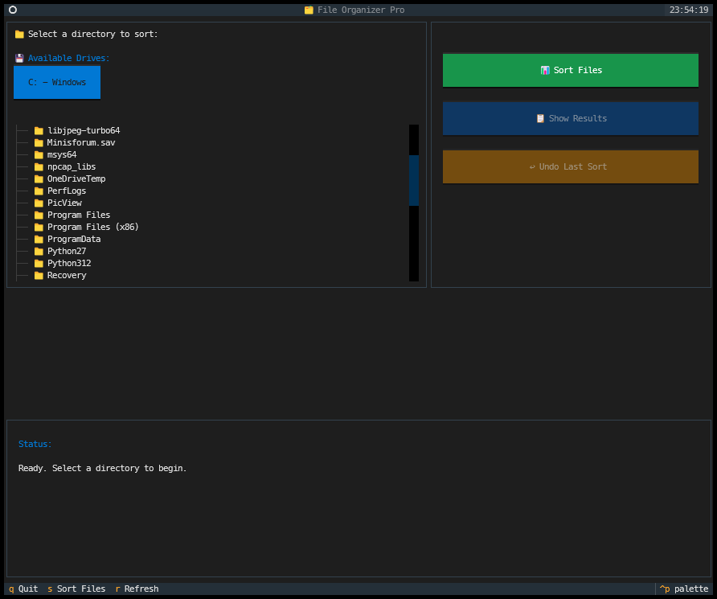

# 🗂️ File Organizer Pro

A modern Text-based User Interface (TUI) application that intelligently sorts files in any directory into appropriate folders based on their file types.



## ✨ Features

- 🖥️ **Modern Interface** - Clean, intuitive TUI built with the Textual library
- 💾 **Drive Selection** - Quick access buttons for all available drives on your system
- 📁 **Directory Navigation** - Browse and select any directory on your computer
- 🔄 **Smart Sorting** - Automatically categorize files based on their extensions
- 📊 **Visual Progress** - Real-time feedback on sorting operations
- 📋 **Detailed Results** - View comprehensive sorting statistics
- ↩️ **Undo Functionality** - Revert sorting operations with automatic cleanup of empty folders
- 🎨 **High Contrast UI** - Improved readability with optimized color schemes
- 🚀 **Efficient Performance** - Only creates category folders when needed

## 🛠️ Installation

1. Clone this repository
2. Install the required dependencies:

```bash
pip install -r requirements.txt
```

## 🚀 Usage

Run the application:

```bash
python file_sorter.py
```

### 🧭 Navigation

- Use the **drive buttons** at the top to quickly select any drive on your system
- Navigate through directories using the directory tree
- Select a directory and press **S** or click the **Sort Files** button to organize files
- View sorting results by clicking the **Show Results** button
- Undo the last sort operation with the **Undo Last Sort** button
- Press **Q** to quit the application

## 📂 Categories

Files are intelligently sorted into the following categories:

- 📄 **Documents** - pdf, docx, txt, md, tex, etc.
- 🖼️ **Images** - jpg, png, gif, psd, raw, etc.
- 🎬 **Videos** - mp4, avi, mkv, mov, etc.
- 🎵 **Audio** - mp3, wav, flac, aac, etc.
- 🗜️ **Archives** - zip, rar, tar, 7z, etc.
- 💻 **Code** - py, js, html, css, java, etc.
- ⚙️ **Executables** - exe, msi, app, dll, etc.
- 🔤 **Fonts** - ttf, otf, woff, etc.
- 📊 **Spreadsheets** - xlsx, csv, ods, etc.
- 📽️ **Presentations** - pptx, pps, odp, etc.
- 🗃️ **Databases** - db, sqlite, sql, etc.
- 🧊 **3D Models** - obj, fbx, stl, blend, etc.
- 📐 **CAD** - dwg, dxf, step, etc.
- ✒️ **Vector** - svg, ai, eps, etc.
- 📚 **Ebooks** - epub, mobi, azw, etc.
- 🔮 **Others** - any other file type

## ⌨️ Keyboard Shortcuts

- **S**: Sort files in the selected directory
- **R**: Refresh the directory tree
- **Q**: Quit the application

## 🆕 Recent Improvements

- 🎨 **UI Enhancements** - Cleaner interface with improved visual hierarchy
- 🔍 **Better Visibility** - Enhanced contrast for text and buttons
- 🧹 **Empty Directory Cleanup** - Automatically removes empty folders during undo operations
- 🚀 **Streamlined Navigation** - Intuitive drive selection with clear labeling
- 💾 **Smart Drive Detection** - Displays drive labels for easier identification
- 🎯 **Focused Interface** - Removed unnecessary UI elements for a cleaner experience
